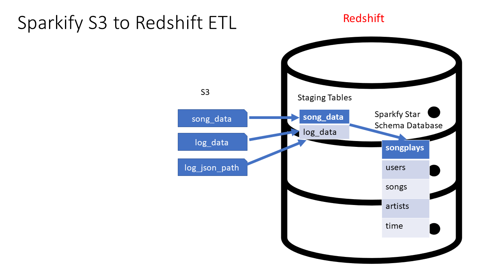

# Data Warehouse with Sparkify

In this project, I will work on a demo version for a music streaming startup, which will migrate the user base and song database to cloud, with the 3 following files:

- The main data resides in S3
- The user activity log will locate on a directory JSON logs
- The metadata of the song will be saved in log_data


On the next session, I will work on an ETL pipeline to extract the data from S3 and stage them in Redshift and transform data into a set of dimensional tables for further analytics.
 


Note that the following prerequisites is the need to complete this project:
- Programming language: **Python** (boto3, configparser, psycopg2)
- **AWS** Services: EC2, S3, IAM, Redshift

# Project path structure
The project structure follows this path:
```plaintext
ETL_DWH_AWS_Project
├── etl_testing.ipynb
├── create_tables.py
├── dwh.cfg
├── etl.py
├── README.md
└── sql_queries.py
```
# Data Structure
## S3 Datasets structure
In here I will mainly work with 2 datasets stored in S3, with the following directories in S3:
- Song data: ```s3://udacity-dend/song_data```
- Log data: ```s3://udacity-dend/log_data```
- 
To properly read log data, we will need the following metadata file as well:
- Log metadata: ```s3://udacity-dend/log_json_path.json```


From these, I will convert them into a staging tables in S3, known as the staging_events and staging_songs with the following fields:

- **staging_events**
  - `artist`
  - `auth`
  - `firstName`
  - `gender`
  - `itemInSession`
  - `lastName`
  - `length`
  - `level`
  - `location`
  - `method`
  
- **staging_songs**
    - `num_songs`
    - `artist_id`
    - `artist_latitude`
    - `artist_longtitude`
    - `artist_location`
    - `artist_name`
    - `song_id`
    - `title`
    - `duration`
    - `year`

## ETL data structure
After ```COPY``` data from the S3 to ETL, we will have 5 tables coming with their own properties to form a [star schema](https://www.databricks.com/glossary/star-schema)


- **songplays** (fact table)
  - `song_play_id`
  - `start_time`
  - `user_id`
  - `level`
  - `song_id`
  - `artist_id`
  - `session_id`
  - `location`
  - `user_agent`

coming with 4 dimensional tables:

- **users**
  - `user_id`
  - `first_name`
  - `last_name`
  - `gender`
  - `level`

- **songs**
  - `song_id`
  - `title`
  - `artist_id`
  - `year`
  - `duration`

- **artists**
  - `artist_id`
  - `name`
  - `location`
  - `latitude`
  - `longitude`

- **time**
  - `start_time`
  - `hour`
  - `day`
  - `week`
  - `month`
  - `year`
  - `weekday`
 
The structure of the data tables will look iike as followed: 


# Configuration for execution

## 1. Set up on AWS Services
Creating resources on AWS using the AWS management console to support the Redshift data warehouse. 
#### Create an IAM Role
* Create a `myRedshiftRole` IAM role with the `AmazonS3ReadOnlyAccess` permission policy attached
#### Create Security Group for Redshift
* Create a `redshift_security_group` security group that authorizes Redshift cluster access (with the default VPC)
#### Create an IAM User for Redshift
* Create an IAM user with below two permission policies attached, and create and save the `Access key` and `Security access key`
    * `AmazonRedshiftFullAccess`
    * `AmazonS3ReadOnlyAccess`
#### Launch a Redshift Cluster
* Create the `redshift-cluster-1` cluster that attaches the `myRedshiftRole` role and the `redshift_security_group` security group 

In fact, We can either config through AWS console or through coding. But in this casse, all the above configurations we will config through the AWS console.

## 2. Set up on Jupyter files
Following the execution order:
- Execute the `create_tables.py` to create the tablesthat we have define.
- Execute the `etl.py` to load the data to the S3 data tables, and then copying it to the Redshift ETL to form the star schema
- After finishing the execution, we can test the query execution from the ETL through `etl_testing.ipynb` file


# Some notification
As the cost for AWS can be really costly, especially when we run the service like Redshift, so the choice of the cluster is important
- For this data, my advice is to setup the node to 4, so that when executing the `etl.py` will only take about 20 minutes to finish the etl.
- While setting up the data, the `copying step` I reccommend to scale down the data as we don't need the complex computation for a simple task for better speed execution with the command `COMPUPDATE OFF` and `STATUPDATE OFF`
- After finishing the test, please delete the AWS Redshift cluter and VPC configuration to save the budget from unecessary money loss.

