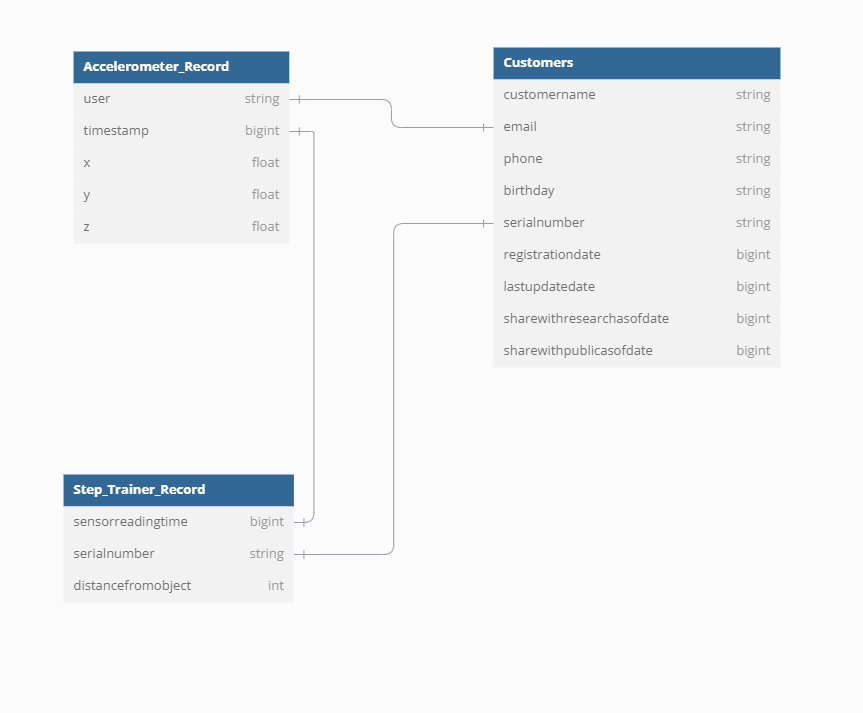

# Starter Data for the STEDI Human Balance Analysis project

# Overview

In this project, I will work on building a lakehouse solution for sensor data used to train for a machine learning model based on the **STEDI Step Trainer**data

Steps to follow:
1. Download customer, accelerometer, and step trainer data from the zip file.
2. Fix the formatting error and incomplete files. We call this the complete & cleaned data.
3. Upload the complete & cleaned data to AWS Glue.
4. Reduce the number of data points but do it smartly. Keep only relevant data.
5. Redo the project with the new data.
6. Record issues met and their solutions.


# Highlights

Original data:
In this project, we will work with three main data types, including 
- Customer Records:
  * serialnumber
  * sharewithpublicasofdate
  * birthday
  * registrationdate
  * sharewithresearchasofdate
  * customername
  * email
  * lastupdatedate
  * phone
  * sharewithfriendsasofdate
- Step Trainer Records:
  * sensorReadingTime
  * serialNumber
  * distanceFromObject
- Accelerometer Records:
  * timeStamp
  * user
  * x
  * y 
  * z
  
Complete & Cleaned data:

- Landing
  * Customer: 956
  * Accelerometer: 81273
Step Trainer: 28680
- Trusted
  * Customer: 482
  * Accelerometer: 40981
Step Trainer: 14460
- Curated
  * Customer: 482
  * Machine Learning: 43681

- Their relationship is presented within this ERD:


# Project flowchart
This project is conducted through AWS Services, such as AWS Athena, AWS Glue and and AWS S3:


# Queries
## All connected rows and sanitized

```
SELECT COUNT(*)

FROM "customer_cleaned_landing" cl

    JOIN "accelerometer_cleaned_landing" al ON cl.email = al.user

    JOIN "step_trainer_cleaned_landing" sl ON cl.serialnumber = sl.serialnumber AND al.timestamp = sl.sensorreadingtime

WHERE cl.sharewithresearchasofdate IS NOT NULL;
```

- There are currently 2,043,198 rows.
- Run time in Athena: 15.173 sec
- Data scanned 316.20 MB

## How many distinct emails are there?

```
SELECT COUNT(DISTINCT email) FROM "customer_cleaned_landing";
```

There are only 957 distinct emails.


## Are there duplicates in step trainer data (duplicated `sensorreadingtime` and `serialnumber` pairs, that is)?

```
SELECT sensorreadingtime, serialnumber, COUNT(*)
FROM step_trainer_cleaned_landing
GROUP BY sensorreadingtime, serialnumber
HAVING COUNT(*) > 1;
```

## Reduced data rows

* Get unique customers by emails with the earliest registrationDate.
* Get relevant accelerometer and step trainer data of those customers.

```
WITH
    cl_distinct_emails AS (
        SELECT *, row_number() OVER (PARTITION BY email ORDER BY email, registrationDate DESC) AS row_num
        FROM customer_cleaned_landing

    )
SELECT DISTINCT *
FROM cl_distinct_emails cl
    JOIN accelerometer_cleaned_landing al
        ON cl.email = al.user AND cl.row_num = 1
    JOIN step_trainer_cleaned_landing sl
        ON cl.serialnumber = sl.serialnumber
            AND al.timestamp = sl.sensorreadingtime;
```

Results: 81,273 rows

# Some precautions:
- I would advise to use the Spark SQL for joinning table, as this would handle SQL Query better than Glue Studio
- When converting the output data, you should include all the files into a single file, for my case, instead as of having many .snappy files I would rather use a single .json file so as to query the data from Athena easier and avoiding the risk of data joinning mismatch or errors for later ETL process.


